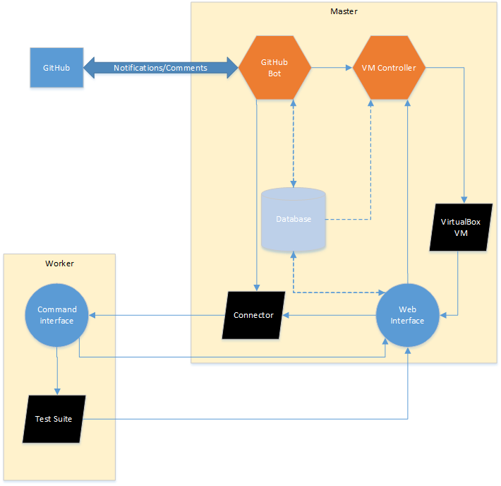

# CCExtractor GitHub bot and automated test suite

This repository contains the code for a GitHub bot, which runs the test suite for CCExtractor automatically, and was 
developed during GSoC 2015.

Unfortunately, VirtualBox is rather slow when it comes down to shared folders or samba, so there is also an option so
that for a certain list of trusted users, the bot can be run on the bare machine. (If you happen to have suggestions to
improve the speed on VirtualBox, please open an issue with your thoughts!).

## Concept



## Installation

### Web part

Deploy the files in the server folder to a web server that has PHP and MySQL installed. Then copy the 
variables-sample.php file to variables.php and fill in the values there so it matches your setup.

### Database

All the necessary tables can be found in an installation SQL file, install.sql.

### Python part

#### Dependencies:

This project makes use of a couple of pip packages (pymysql, githubpy, pyvbox and python-dateutil), which can be installed by calling 
the pip command:

```
sudo pip install pymysql
sudo pip install githubpy
sudo pip install pyvbox
sudo pip install python-dateutil
```

#### Scripts

Move all the files to your local folder, and copy configuration_sample.py to configuration.py and fill in the variables 
with the appropriate values.

### Worker

Deploy the files in the worker folder to the worker server (which will be running the test-suite on the bare server).
